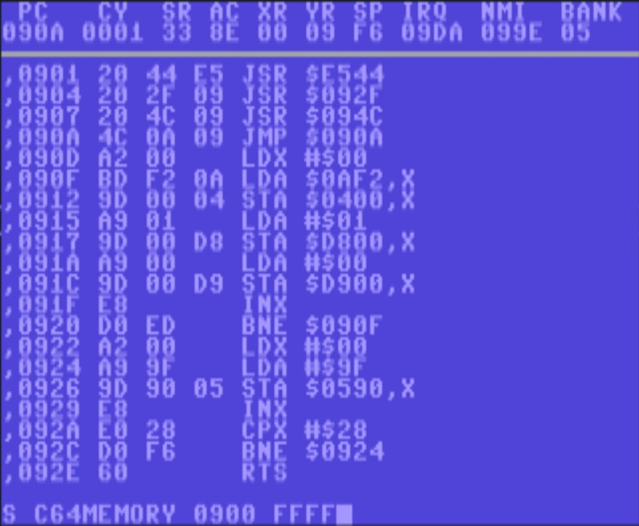
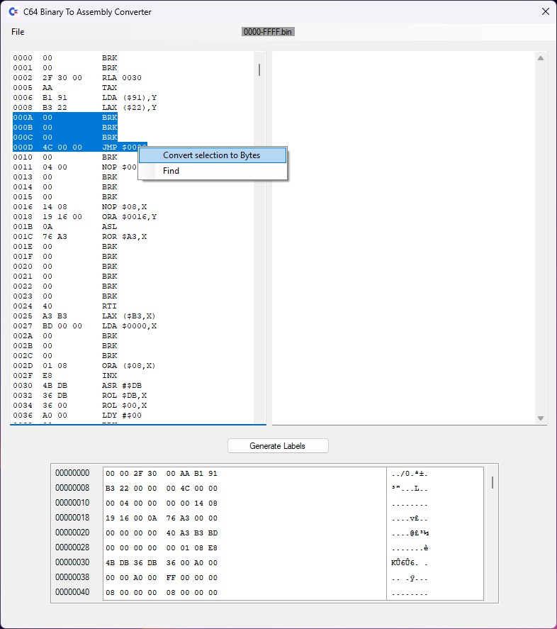

# C64 Binary to Assembly convertor
This is a small tool to reverse engineer a `Commodore 64` binary file & convert it back into assembly code.

The tool will load the selected file, reverse engineer the binary and display C64 assembly code, it can also add labels for branches, jumps and loops which allows the code to be relocateable.

Fire up your favourite C64 emulator & write out some bytes of interest !

Open this tool & load the bytes you have just saved.
Once loaded you can select the chunk of memory to automatically add labels to branches (BNE) and jumps (JMP).
I plan to extend this functionality to include Loads(LDA) and Stores(STA) in the near future.

Either windows output can be saved, as long as it's populated.

The resulting code can then be saved to disk & loaded into C64 Studio.

If Illegal opcodes are found during the add labels processing, you will be prompted if you would like them automatically converting to data statements an appending into the code.

The reason for creating this tool... some 30 something years after learning to write 6502 & a few C64 demo's i wanted to view the code.

After trying to save Commodore 64 dis-assembled code & manually adding labels by hand, i quickly became bored !
So this seemed like a much better idea than adding labels by hand !!

**This has only been tested on one small intro, it worked ok after re-building the generated Assembly file with C64 Studio.**
