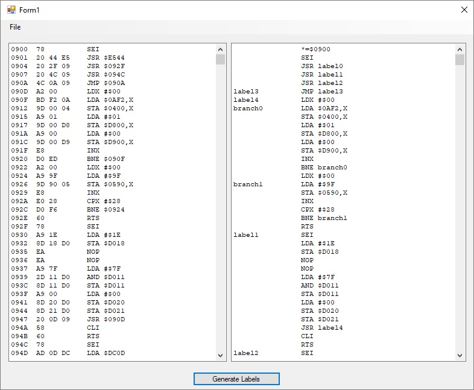

# C64-Code-Relocator
This is a small tool to load, parse and display C64 assembly code, add lables & write it to disk.

Fire up your favourite C64 emulator & write out some bytes of interest !

Open this tool & load the bytes you have just saved.
Once loaded you can select the chunk of memory to automatically add labels to, for both branches and jumps.
The resulting code can then be saved to disk & loaded into C64 Studio.

The reason for creating this tool... some 30 something years after writing some C64 demo's i wanted to reminisce.

After trying to save Commodore 64 dis-assembled code & manually adding labels by hand, i quickly became bored !
So this seemed like a much better idea than adding labels by hand !!

**This has only been tested on one small intro, it worked ok after re-building the generated Assembly file with C64 Studio.**
